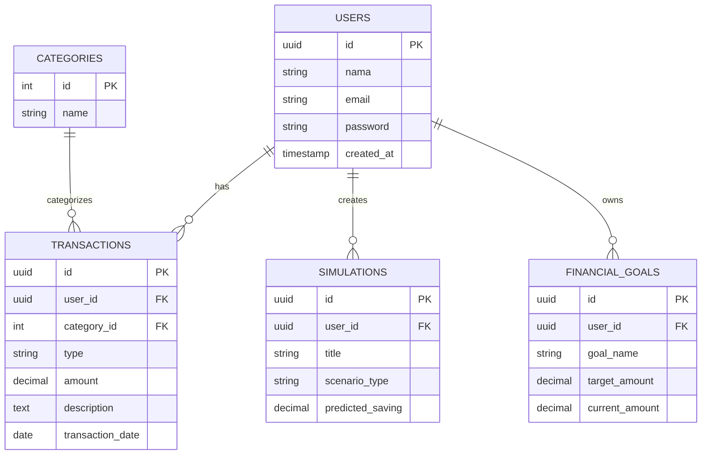

# ERD Econiverse

```mermaid
erDiagram

USERS ||--o{ TRANSACTIONS : has
CATEGORIES ||--o{ TRANSACTIONS : categorizes
USERS ||--o{ SIMULATIONS : creates
USERS ||--o{ FINANCIAL_GOALS : owns

USERS {
    uuid id PK
    string nama
    string email
    string password
    timestamp created_at
}

CATEGORIES {
    int id PK
    string name
}

TRANSACTIONS {
    uuid id PK
    uuid user_id FK
    int category_id FK
    string type
    decimal amount
    text description
    date transaction_date
}

SIMULATIONS {
    uuid id PK
    uuid user_id FK
    string title
    string scenario_type
    decimal predicted_saving
}

FINANCIAL_GOALS {
    uuid id PK
    uuid user_id FK
    string goal_name
    decimal target_amount
    decimal current_amount
}
```
